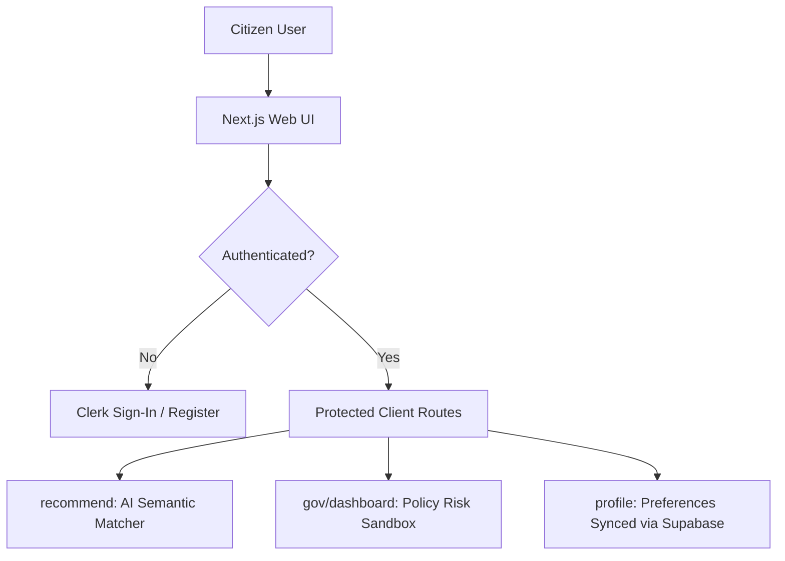

# 🔍 SchemeLens — Week 3 Progress Report

## Community Service Project (CSP)

---

## 1. INTRODUCTION (WEEK 3)

The third week of the **SchemeLens** project focused on transitioning our high-performance Python FastAPI backend and AI risk models into a fully integrated, modern, and production-grade fullstack web application. Following the advanced API design, Gemini query expansion, and n8n automations built in Week 2, Week 3 realized a secure, user-friendly, and feature-rich user portal.

Key milestones of this week included:
* **Production-Grade Next.js Web Client:** Engineered a sleek, highly interactive, and responsive user portal using React and standard styling conventions. The interface features citizen scheme discovery tools, administrative policy risk dashboards, omni-channel alerts configuration, and developer key generation.
* **Identity Management & Access Control (Clerk):** Integrated Clerk Authentication to offer secure email, passwordless OTP, and OAuth sign-in workflows, establishing robust security boundaries across protected application layers.
* **Dynamic Citizen Profiles & Key Storage (Supabase):** Set up a persistent dynamic database connection using Supabase Postgres to sync demographic profile preferences and active developer API keys securely in the cloud.
* **Fullstack End-to-End API Integration:** Connected Next.js UI states to the local FastAPI FAISS vector indices, custom policy risk auditer endpoints, and SQLite ratings models.

By merging AI semantic search with Clerk authentication and Supabase Postgres sync, SchemeLens has achieved a state-of-the-art, secure, and production-ready architecture designed to empower both everyday citizens and administrative policy auditors.

---

## 2. ACTIVITIES PERFORMED

During Week 3, the following frontend engineering, security configuration, and database orchestrations were completed:

* **Developed Responsive Next.js Web Client:** Engineered an aesthetic, sleek frontend dashboard utilizing modern web layouts, clean card groups, and intuitive hover effects.
* **Integrated Clerk Authentication Flow:** Wrapped the root Next.js app in a secure `<ClerkProvider>` block to enforce dynamic session monitoring, custom `<SignIn />` layouts, and secure account credential managers.
* **Connected Supabase Postgres client:** Integrated a dynamic cloud relational database using `frontend/src/utils/supabase.js` to persist and fetch dynamic user demographic states (caste, occupation list, state domicile, annual income) and api credentials.
* **Designed Dynamic AI Search Panel (`/recommend`):** Crafted an elegant, multi-tier segment control to swap search modes between `Normal Vector` (classical FAISS dense passage retrieval) and `Smart LLM Enhanced` (Gemini API keywords expansion), complete with a live demographics matching banner.
* **Exposed Live Rating Visualizations (`/top-rated`):** Connected Next.js pages to the SQLite `/api/top-rated` backend endpoint to display average user ratings, direct reviews, and redirect links to official scheme portals.
* **Built Policy Auditor Sandbox Panel (`/gov/dashboard`):** Designed an interactive dashboard with sliding weight adjusters for Setting Risk-Dimension Weights (accessibility, bureaucratic, market distortion, ecological, social friction) to compute composite risk scores in real-time.
* **Configured Omnichannel Delivery Page (`/delivery`):** Developed dashboard components to route scheme matching notifications to WhatsApp (via Twilio), Telegram bot links, and webhook n8n nodes.
* **Established Developer Key Playgrounds (`/developer`):** Built a sandbox interface to allow developers to provision, list, and revoke live API credentials stored securely in Supabase.
* **Implemented Robust Anonymous Review Modes:** Fixed infinite loading loops in `/recommend`, `/delivery`, `/developer`, and `/profile` pages when a user is not logged in. This enables visitors to review pages in "Demo Mode" while preventing crashes on profile images and displaying helpful log-in call-to-action notices.

---

## 3. TECHNICAL PROGRESS

### 3.1 Next.js Fullstack Web Portal

The citizen and administrative pages were built using modular React patterns. Rather than standard default styles, the pages employ a curated typography system, sleek slate border grids, and dynamic state-driven interactions.



* **Interactive Search Panel:** Swapping search styles transforms the theme from a standard vector match (classic light slate) to a premium search interface (high-contrast dark-slate cards) based on the active mode.
* **Anonymous Session Guardrails:** Pages like `/developer`, `/delivery`, and `/profile` dynamically fall back to anonymous, interactable "Demo Modes" if the user is not authenticated, showing beautiful log-in prompt modules instead of throwing runtime errors.

### 3.2 Secure Identity Management with Clerk

We wrapped application boundaries inside a secure Clerk authorization layer to protect user preferences and dynamic keys.

* **Diagnostic Developer Portal:** Designed an onboarding screen that automatically catches missing environment variables and renders dynamic setup instructions to assist team members in configuring their local `.env` keys.
* **Authentication States:** Standard authentication components (`<SignedIn>`, `<SignedOut>`, `<UserButton>`) manage real-time session updates across the navigation bar.

### 3.3 Dynamic Cloud Synchronization with Supabase

To persist citizen preference data and api credentials, we integrated **Supabase Postgres** as our cloud-hosted relational layer:

```
[User Updates Profile UI] ──► [frontend/src/utils/supabase.js] ──► [Supabase Postgres Profiles Table] ──► [Automatic Profile Matching In Vector Search]
```

* **Dynamic Domicile Matching:** Edits to caste categories, occupations, and family income limits on the `/profile` page write directly to the Supabase remote DB, which are then used to pre-filter and prioritize search scores during semantic vectors lookup.
* **API Credential Store:** Key definitions, names, and creation timestamps are fully stored and queried in real-time.

---

## 4. TECHNOLOGIES USED

| Component | Technology | Role in Week 2 | Upgraded / Added in Week 3 |
| :--- | :--- | :--- | :--- |
| **Frontend Framework** | — | None | **Next.js (React, Turbopack)** |
| **Styling Library** | — | None | **Vanilla CSS, Lucide React Icons** |
| **Authentication Engine** | — | None | **Clerk Identity Manager** (SSO & OTP flows) |
| **Cloud Database** | — | None | **Supabase Postgres** (Dynamic Relational Layer) |
| **Local Database** | SQLite3 | Initial SQL schema | SQLite transactional queries for ratings and feedback |
| **API Endpoints** | FastAPI | Core Uvicorn routing | Connected fullstack request/response payloads |
| **Integration Webhooks** | cURL / Localhost | Postman | **Omnichannel Telegram/WhatsApp API hooks** |

---

## 5. GITHUB REPOSITORY & DEVELOPMENT TESTING

All developments have been successfully merged, tested, and pushed to the repository:
* **GitHub Repository:** [afngh/SchemeRecommendationSystem](https://github.com/afngh/SchemeRecommendationSystem)

---

## 6. OUTCOME OF WEEK 3

By the end of Week 3:
* **Unified Web App Interface Deployed:** Implemented clean client panels for citizens (`/recommend`, `/profile`, `/top-rated`) and administrators (`/gov/dashboard`, `/developer`, `/delivery`).
* **Multi-Tenant Authentication Complete:** Protected application layouts and user sessions using Clerk Google/Email credentials.
* **Persistent Supabase Cloud Sync Setup:** Successfully linked citizen demographic preferences and developer keys to a remote Supabase Postgres database.
* **Real-time Scoring Verified:** Wired frontend sandbox audit inputs to update FastAPI’s mathematical policy risk models instantly.
* **Anonymous Session Stability:** Patched and resolved Next.js state-locking bugs on navbar components and delivery dashboards when users are not logged in.

---

## 7. CSP PROJECT PLAN FOR THE CONCLUDING STAGE

For the final wrapping phase of the Community Service Project (CSP):
* **Staging Cloud Deployment:** Host the FastAPI server on Railway and compile Next.js production builds for Vercel deployment.
* **Refine Prompt Enhancers:** Add advanced context prompts to Gemini models to parse vernacular, multi-lingual inputs from rural communities.
* **Compile Final CSP Dossier:** Consolidate Week 1, Week 2, and Week 3 reports into a final academic submission detailing local social benefits and technical policy outcomes.
