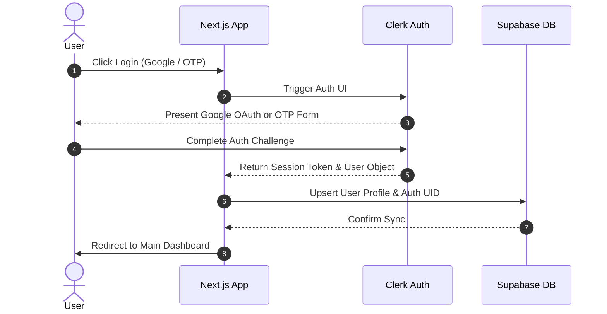

# SchemeLens Next-Gen Frontend Roadmap & Specifications

This document outlines the architectural roadmap, functional requirements, and integration patterns for the upgraded **SchemeLens** frontend. 

---

## 1. Authentication Layer: Clerk + Supabase

To provide secure authentication, profile management, and persistent search preferences, SchemeLens integrates **Clerk** (for frontend identity) and **Supabase** (for backend data synchronization).



### Integration Details
* **Frontend Authentication (Clerk)**:
  * Google One-Tap sign-in.
  * Passwordless email verification via OTP (One-Time Passcodes).
  * Clerk React components utilized directly in root layout and middlewares.
* **Database & Row-Level Security (Supabase)**:
  * Automatically maps Clerk's `user_id` to Supabase's `profiles` table using database triggers or frontend sync middleware.
  * Stores:
    * User demographic profile (age, caste, state, annual income, occupation tags).
    * Saved schemes and bookmarks.
    * Personalized delivery preferences (WhatsApp, Telegram, Email).
    * History of ratings and feedback submitted.

---

## 2. Unified Citizen Portal (Main Dashboard)

Once authenticated, citizens arrive at the main portal. This page simplifies discoverability, offering granular controls over recommendation count and intelligence layers.

### Interface & Controls
* **Query Customizer**:
  * Large, modern semantic AI text prompt input box.
  * Quick-select filters (Chips for student, farmer, woman, etc.) that feed directly into the prompt box.
* **Result Limit Selector (`top_k`)**:
  * Dropdown or interactive slider to adjust search limits: `[3, 5, 10, 15, 20]` schemes.
* **Intelligence Toggle**:
  * **Normal Search (Free)**: Runs raw FAISS semantic matches over the database via `POST /api/recommend` (extremely fast, zero LLM cost).
  * **Smart Search (Premium)**: Uses the Gemini-powered query enhancer via `POST /api/recommend/premium` to extract demographics, policy keywords, and synonyms, providing highly accurate matching.

---

## 3. Advanced Government & Policy Risk Hub

The government dashboard transitions from a static data viewer into an **active research sandbox**. Policy makers can interactively simulate, test, and analyze risks.

### Features
1. **The Static Risk Monitor**:
   * Displays overall stats (avg risk, category-wide counts) fetched from `/api/gov/risk-summary`.
   * Interactive sorting/filtering by category and risk level.
2. **"Build Your Own Risk Algorithm" Sandbox (LangChain Powered)**:
   * Government researchers write custom prompts defining what they consider a "risk" in plain English:
     * *Example Prompt*: "Flag any agricultural scheme that encourages deep drilling for groundwater or doesn't mandate rainwater harvesting."
   * **The Backend Process**: Uses **LangChain + Gemini** on the server-side to parse the custom prompt, map it to the database using vector descriptions, analyze the matches, and assign custom ecological/bureaucratic risk scores.
   * **The Frontend Interface**: 
     * Plain English prompt input area.
     * Dynamic weight sliders (e.g. adjust custom exclusion vs. environmental weight from 0% to 100%).
     * Real-time matching list showing updated custom risk percentages.

---

## 4. Omnichannel Delivery Hub ("Get Delivered")

The **"Get Delivered"** portal acts as a central hub where users can subscribe to persistent scheme updates, alerts, and application guide packages across multiple messaging platforms.

```
┌────────────────────────────────────────────────────────┐
│               SCHEMELENS DELIVERY HUB                 │
├────────────────────────────────────────────────────────┤
│  [X] Email Notifications   — Weekly summaries & alerts  │
│  [ ] WhatsApp Delivery     — Immediate eligibility docs │
│  [ ] Telegram Bot Updates  — Real-time deadline alerts │
│                                                        │
│  [ Configure WhatsApp Number ] [ Subscribe ]          │
└────────────────────────────────────────────────────────┘
```

### Automation Channels
1. **n8n Webhook Engine**:
   * Delivers matched schemes, application steps, and document checklist pdfs directly to citizens.
   * Integrates pre-built n8n workflows that handle heavy delivery queues, retries, and formatting.
2. **WhatsApp Business Integration**:
   * Uses WhatsApp Business API/Twilio to message users direct matching cards, complete with "Apply Now" buttons.
3. **Email Subscriptions**:
   * Sends structured HTML templates listing recommended schemes, closing dates, and local offices.
4. **Telegram Bot**:
   * Interactive companion bot (`@SchemeLensBot`) that lets users query schemes right from their chat client and alerts them to application deadlines.

---

## 5. Developer Portal & Dynamic API Docs

To foster a robust ecosystem for civic-tech developers, SchemeLens exposes its raw semantic recommendation and risk engines via a beautiful developer-facing portal.

### Features
* **Interactive Swagger/OpenAPI Console**:
  * Embedded API playbooks detailing each endpoint.
  * Real-time "Try It Out" buttons pre-configured for CORS requests.
* **API Key Management**:
  * Developers log in with Clerk to generate custom API keys stored in Supabase.
  * Enables external integrations (e.g. state government dashboards, ngo trackers) to query our backend semantic engine.
* **Usage & Analytics Graphs**:
  * Beautiful CSS charts showing API query volumes, average response times, and premium quota metrics.

---

## 6. Premium Brainstormed Additions (Our Recommendations)

* **Interactive Onboarding Chatbot ("Lensy")**:
  * Rather than a static search box, citizens can choose a conversational guide who interviews them ("What is your state?", "Are you studying?", "What's your family income?") and compiles the final optimized profile vector automatically.
* **Draft Policy Sandbox (Pre-Publishing Risk Check)**:
  * For government users, a visual notepad where they can copy-paste a *draft* of a new policy, click "Run Simulation", and instantly see forecasted risk scores *before* officially deploying the scheme.
* **Ministry & Department Leaderboard**:
  * Publicly ranks government departments on their policy health (e.g., Ministry of MSME vs. Ministry of Education based on average exclusion and bureaucratic friction scores), encouraging clean and simplified policies.
