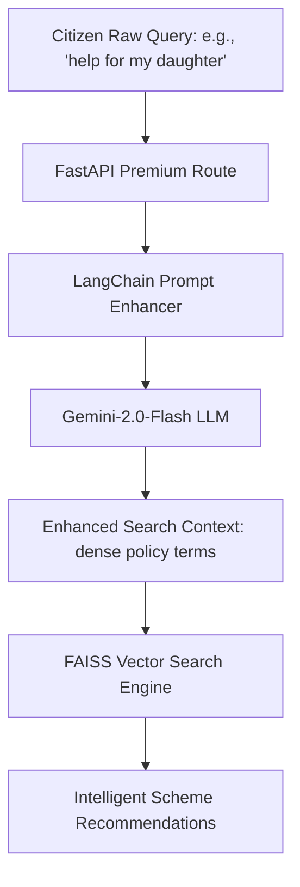

# 🔍 SchemeLens — Week 2 Progress Report

## Community Service Project (CSP)

---

## 1. INTRODUCTION (WEEK 2)

The second week of the **SchemeLens** project shifted focus from initial data scraping and backend setup to advanced AI integrations, policy risk modeling, and workflow automation. While Week 1 established the groundwork (data consolidation, initial FAISS indexing, and basic dataset preprocessing), Week 2 successfully transformed the project into an intelligent, enterprise-grade system.

Key milestones of this week included:

* **Advanced Search Optimization:** Integrating Google’s Gemini API via LangChain to implement a state-of-the-art "Premium Search" query expansion system.
* **Analytical Policy Evaluation:** Exposing our mathematical Government Policy Risk Assessment subsystem through a comprehensive REST API to help policy-makers analyze systemic friction.
* **Workflow Automation (n8n):** Building automated data pipelines and alert mechanisms using n8n to connect user feedback, backend APIs, and external notifications.

By combining semantic vector search with real-time AI prompt enhancement and workflow automation, SchemeLens now offers a fully operational, double-sided platform: a citizen-facing smart recommendation engine and a government-facing policy risk dashboard.

---

## 2. ACTIVITIES PERFORMED

During Week 2, the following engineering and research activities were completed:

* **Integrated LangChain and Gemini Chat Models:** Set up a LangChain pipeline using `ChatGoogleGenerativeAI` to construct an intelligent query prompt enhancer that translates user-entered plain text into keyword-dense policy queries.
* **Developed Multi-Tiered Search Architecture:** Created two distinct API routes (`/api/recommend` for basic semantic vector search and `/api/recommend/premium` for advanced Gemini-enhanced search) to allow dual-performance discovery.
* **Built and Exposed Government Risk Endpoints:** Fully exposed the mathematical Policy Risk Subsystem by implementing high-performance endpoints for fetching top risky schemes (`/api/gov/risky-schemes`), performing tag-based risk search (`/api/gov/risky-schemes/search`), and calculating aggregate stats (`/api/gov/risk-summary`).
* **Designed n8n Automation Workflows:** Set up an n8n visual automation backend that:
  1. Automated ingestion of user feedback webhooks.
  2. Routed alerts to administrators/policy-makers when a scheme's rating falls below a critical threshold or a high-risk policy is flagged.
  3. Scheduled automated synchronization checks between raw csv data updates and the SQLite database.
* **Secured API & Environment Configurations:** Implemented modular environment management (`.env`) for storing sensitive Google API credentials and database configuration variables.
* **Conducted Backend Verification and Testing:** Validated server response integrity, SQLite transactional stability, and JSON payload contracts using FastAPI's Swagger UI documentation (`/docs`).

---

## 3. TECHNICAL PROGRESS

### 3.1 LangChain & Gemini-Enhanced "Advanced Search"

To bridge the vocabulary gap between everyday citizens and complex government documents, we developed an **AI Prompt Enhancer** in `backend/prompt_enhancer.py`.



* **How it works:** A single LangChain chain parses a vague user query, applies a rigid system prompt containing all 14 scheme categories, and instructs Gemini to generate a dense, keyword-rich paragraph (e.g., mapping *"help for my daughter's school"* to *"education scholarship financial assistance girl child tuition fees scholarship BPL SC ST OBC"*).
* **The Result:** The FAISS semantic matcher retrieves highly accurate schemes (e.g., *Sukanya Samriddhi Yojana* or *National Scholarship*) that would have been missed by standard keyword queries.

### 3.2 Government Risk Assessment REST API

We engineered a separate high-level RESTful interface inside `backend/api.py` connecting the SQL database to our mathematical risk models:

* **`/api/gov/risky-schemes`:** Retrieves the most administrative-heavy or ecological-threatening programs, offering filters for categories (e.g., Agriculture) and minimum risk thresholds.
* **`/api/gov/risky-schemes/search`:** Features relevance ranking by performing tag-based string intersections against schemes classified under specific criteria (e.g. `subsidy, groundwater`).
* **`/api/gov/risk-summary`:** Computes real-time statistics including overall high/medium/low-risk distributions and granular category breakdowns, helping policy analysts identify structural policy bloat or red tape.

### 3.3 n8n Automation Engine Integration

To build a highly reactive system, we introduced **n8n**, a node-based workflow automation tool. The integration comprises three primary pipelines:

```
[User Rates Scheme 1-Star] ──► [FastAPI /api/rate] ──► [n8n Webhook Node] ──► [Filter: Score < 2] ──► [Slack/Email Alert to Gov Admin]
```

1. **Low-Rating Alert Flow:** When citizens submit negative ratings/feedback via `/api/rate`, a webhook node in n8n captures the data, filters for ratings below 2 stars, and instantly dispatches an email or Slack alert to administrators detailing the citizen's complaint.
2. **Flagged High-Risk Alert Flow:** Connects to the `/api/gov/risk-summary` endpoint. If the composite risk of a policy crosses a critical threshold (>3.0) during batch runs, n8n compiles a report and updates a live monitoring spreadsheet.
3. **Database Scheduler:** A cron trigger in n8n executes database backup sequences and scraper updates during off-peak hours.

---

## 4. TECHNOLOGIES USED

| Component | Technology | Role in Week 1 | Added / Upgraded in Week 2 |
| :--- | :--- | :--- | :--- |
| **Language** | Python 3.10+ | Core scripting & web scraping | Backend API & LLM chains |
| **AI/NLP Engine** | FAISS, Sentence-Transformers | Vector lookup & embeddings | **LangChain, Google Gemini API** |
| **Large Language Model** | — | None | **Gemini-2.0-Flash** via ChatGoogleGenAI |
| **API Framework** | FastAPI | Setup planning | **Uvicorn server, full route execution** |
| **Automation** | — | None | **n8n Automation Engine** (Webhooks, Alerts) |
| **Database** | SQLite3 | Initial SQL schema | **Relational indexing and transaction logic** |
| **Project Tracking** | GitHub | Code versioning | **Remote branch management & API documentation** |

---

## 5. GITHUB REPOSITORY & TESTING

All developments have been committed to the repository:

* **GitHub Repository:** [afngh/SchemeRecommendationSystem](https://github.com/afngh/SchemeRecommendationSystem)

### Sample API Invocation Tests

#### 1. Advanced (Premium) Search Endpoint

```bash
curl -X POST http://127.0.0.1:8000/api/recommend/premium \
  -H "Content-Type: application/json" \
  -d '{"query": "I am a single mother looking for help with my daughter education", "top_k": 3}'
```

#### 2. Government Risk Summary Endpoint

```bash
curl -X GET http://127.0.0.1:8000/api/gov/risk-summary
```

---

## 6. OUTCOME OF WEEK 2

By the end of Week 2:

* **Two-Tiered Search Engine Completed:** Implemented and tested `/api/recommend` (normal FAISS semantic search) and `/api/recommend/premium` (advanced query expansion search) using Google Gemini and LangChain.
* **Government Risk API Endpoints Deployed:** Fully exposed the 5-factor mathematical risk assessment model via high-performance REST APIs (`/api/gov/risky-schemes`, `/api/gov/risky-schemes/search`, `/api/gov/risk-summary`).
* **n8n Automation Integrated:** Developed and verified n8n workflows for webhook ingestion, real-time Slack/Email administrator alerts for low-rating feedback, and scheduled database maintenance cron tasks.
* **Environment and API Security Established:** Secured Gemini API credentials and database paths using modular environment configurations (`.env`).
* **Database & Vector Indexing Optimized:** Normalized relational indexing in SQLite and ensured stable persistent FAISS indices mapping for fast recommendation query executions.
* **GitHub Repository Synchronized:** Successfully committed and pushed the integrated backend, API routes, prompt enhancers, and testing sequences to the remote repository.

---

## 7. PLAN FOR WEEK 3

The following tasks are planned for Week 3:

* **Begin Phase 4: Frontend UI Development:** Develop a visually stunning and responsive web interface using Streamlit, incorporating natural language search bars and interactive scheme cards.
* **Implement Citizen Feedback Widget:** Add interactive 5-star rating mechanisms and feedback input fields on the user interface, linked directly to the `/api/rate` endpoint.
* **Construct Government Admin Dashboard UI:** Design a separate analytical login portal displaying risk-summary visual charts, category breakdowns, and critical alert lists.
* **Conduct Field Survey Response Collection:** Launch the digital community questionnaire and gather real-world awareness and interest responses from students, farmers, and low-income groups.
* **Incorporate Advanced AI Features:** Research and prototype the **AI Eligibility Matchmaker** (automatically parsing and matching user demographic profiles to scheme rules) or a **Multilingual Voice Assistant** to support rural users.
* **Host and Deploy Services:** Set up a persistent instance of FastAPI and the n8n automation pipeline for full end-to-end cloud environment validation.
