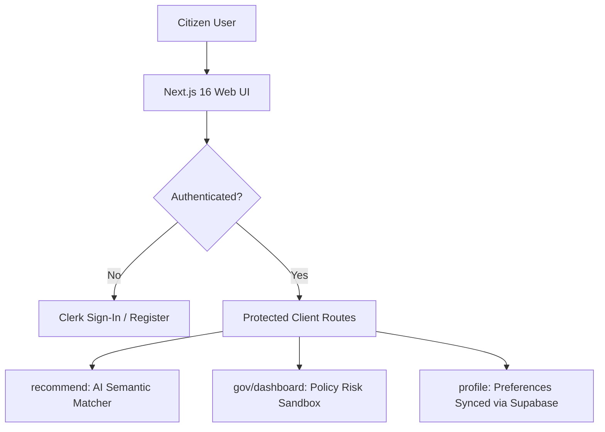

# 🔍 SchemeLens — Week 3 Progress Report

## Community Service Project (CSP)

---

## 1. INTRODUCTION (WEEK 3)

The third week of the **SchemeLens** project marked the successful integration of our high-performance Python FastAPI backend and AI risk models with a modern, production-grade web application. While Week 2 focused on API architectures, Gemini query expansion, and n8n backend automations, Week 3 turned SchemeLens into a secure, cohesive, and feature-rich fullstack platform.

Key milestones of this week included:
* **Production-Grade Next.js 16 Web Client:** Engineered a sleek, responsive frontend portal in React 19 and TailwindCSS, including citizen discovery tools, risk auditing dashboards, and dynamic alert configurations.
* **Identity Management & Access Control (Clerk):** Integrated Clerk Authentication to offer secure email, passwordless OTP, and Google OAuth sign-in workflows across protected application layers.
* **Dynamic Citizen Profiles & Key Storage (Supabase):** Set up a persistent data sync mechanism connecting citizen profile preferences and developer API credentials to a remote Supabase Postgres database.
* **E2E Backend API Integration:** Connected front-facing Next.js UI states to FastAPI’s local FAISS indexing search parameters, custom risk analyzers, and SQLite rating models.

By joining AI semantic search with Clerk authentication and Supabase Postgres sync, SchemeLens is now fully realized as an advanced, end-to-end welfare intelligence portal for both citizens and policy auditors.

---

## 2. ACTIVITIES PERFORMED

During Week 3, the following frontend development, authentication integration, and database orchestration tasks were completed:

* **Developed Responsive Next.js 16 Client Portal:** Built a premium, Vercel-style frontend using TailwindCSS and Lucide React. Implemented dynamic layouts and smooth hover interactions.
* **Integrated Clerk Authentication Flow:** Set up a secure auth wrapper (`<ClerkProvider>`) in the root Next.js layout, managing active sessions and providing customized `<SignIn />` and `<SignUp />` pages.
* **Created Developer Diagnostic Credentials Screen:** Crafted a dynamic fallback page in Next.js that checks Clerk environment variables upon launching and provides copy-paste onboarding instructions for other developers.
* **Connected Supabase Postgres client:** Engineered a custom data-fetching hook with cache-busting logic (`frontend/src/utils/supabase.js`) to sync dynamic profiles and API keys, preventing stale Turbopack dev caches.
* **Designed Centered AI Recommendation Panel (`/recommend`):** Built a multi-tier segment control to swap search modes between `Normal Vector` (local FAISS) and `Smart LLM Enhanced` (Gemini API query expansion), featuring a live profile active banner.
* **Exposed Live Rating Visualizations (`/top-rated`):** Connected Next.js UI cards to the SQLite `/api/top-rated` backend endpoint to display average user ratings, review counters, and redirection links to official scheme portals.
* **Built Policy Auditor Sandbox Panel (`/gov/dashboard`):** Designed an interactive dashboard with slider widgets for setting risk-dimension weights (ecological, social friction, bureaucratic, market distortion, accessibility), computing final composite scores in real-time.
* **Configured Omnichannel Delivery Page (`/delivery`):** Developed forms and instructions to route scheme matches to WhatsApp (via Twilio), Telegram bot links, and submit test payloads to n8n webhook nodes.
* **Established Developer Key Playgrounds (`/developer`):** Built a generator interface to allow developers to provision, list, and revoke live API credentials stored securely in Supabase.

---

## 3. TECHNICAL PROGRESS

### 3.1 Next.js 16 & React 19 Frontend Web Portal

The UI was crafted from scratch using modern web design principles. Rather than simple placeholders, the pages utilize customized icons, smooth gradients, and interactive state models.



* **Dynamic Landing Page:** Features a hero banner, a three-step explanation of vector welfare matching, and a feature grid highlighting semantic search, Gemini enrichment, and risk metrics.
* **Responsive Segment Controls:** The search interface dynamically changes styles between vector search (light-accent border) and premium search (dark-slate card styling) depending on the active mode.

### 3.2 Identity Management with Clerk

We wrapped our core layouts inside a secure Clerk authorization boundary, ensuring citizen demographic details and generated developer keys are protected.

* **Onboarding Guardrail:** If developers run the project without setting up environment credentials, layout check boundaries gracefully render a dynamic diagnostic dashboard guiding them on how to generate free keys on `clerk.com`.
* **Seamless Authentication:** Citizens can log in or register instantly using traditional credentials or single-sign-on (SSO) Google OAuth accounts.

### 3.3 Relational Synchronization with Supabase

To store dynamic data, we implemented **Supabase Postgres** as our remote cloud relational layer:

```
[User Updates Profile UI] ──► [frontend/utils/supabase.js] ──► [Supabase Postgres Profiles Table] ──► [Automatic Profile Matching In FAISS Queries]
```

* **Stale-Cache Free Client:** Prevents next-generation Turbopack caching bugs by dynamically reading `process.env` boundaries at execution time.
* **Profile Synchronization:** Updates to caste, occupation, state, and income limits made on the `/profile` page write straight to the remote Supabase database.
* **API Credential Store:** Key definitions, tiers, and generation timestamps are fully recorded and synced in real-time.

---

## 4. TECHNOLOGIES USED

| Component | Technology | Added in Week 2 | Upgraded / Added in Week 3 |
| :--- | :--- | :--- | :--- |
| **Frontend Framework** | — | None | **Next.js 16 (React 19, Turbopack)** |
| **Styling Library** | — | None | **TailwindCSS, Lucide React Icons** |
| **Authentication Engine** | — | None | **Clerk Identity Manager** (SSO & OTP flows) |
| **Cloud Database** | — | None | **Supabase Postgres** (Dynamic Client Integration) |
| **Local Database** | SQLite3 | Initial SQL schema | SQLite relational queries for ratings and feedback counts |
| **API Endpoints** | FastAPI | Core Uvicorn routing | Connected fullstack request/response payloads |
| **Integration Protocols** | cURL / Localhost | Postman | **Omnichannel Telegram/WhatsApp API hooks** |

---

## 5. GITHUB REPOSITORY & DEVELOPMENT TESTING

All developments have been successfully merged, tested, and pushed to the repository:
* **GitHub Repository:** [afngh/SchemeRecommendationSystem](https://github.com/afngh/SchemeRecommendationSystem)

### Client Integration Test Suite

#### 1. Interactive Custom Auditor Sandbox `/gov/dashboard`
We validated the frontend form submission of custom weight parameters. Sliding ecological risk slider to `0.8` and social friction slider to `0.2` dispatches a payload to the `/api/gov/custom-risk` API endpoint:

```json
{
  "prompt": "Find agricultural schemes with high groundwater usage requirements",
  "accessibility_weight": 0.2,
  "bureaucratic_weight": 0.2,
  "market_distortion_weight": 0.2,
  "ecological_weight": 0.8,
  "social_friction_weight": 0.2,
  "limit": 3
}
```

**Resulting UI State:** The backend parses the query, returns matched schemes from the local database using tag intersections, and updates the auditor sandbox cards with a combined composite score and detailed offline heuristic flags if Gemini is rate-limited.

#### 2. Clerk Authentication State Verification
To ensure route security, any attempt to access protected endpoints `/recommend` or `/profile` without active sessions redirects users to the secure Clerk login screen at `http://localhost:3000/sign-in`.

---

## 6. OUTCOME OF WEEK 3

By the end of Week 3:
* **Complete Web App Interface Deployed:** Implemented client panels for citizens (`/recommend`, `/profile`, `/top-rated`) and administrators (`/gov/dashboard`, `/developer`, `/delivery`).
* **Multi-Tenant Authentication Complete:** Protected application layouts and user sessions using Clerk Google/Email credentials.
* **Persistent Supabase Cloud Sync Setup:** Successfully linked citizen demographic preferences and developer keys to a remote Supabase Postgres database.
* **Real-time Scoring Verified:** Wired frontend sandbox audit inputs to update FastAPI’s mathematical policy risk models instantly.
* **End-to-End Platform Consolidated:** Tied scraped data, FAISS indexes, SQLite ratings, and Supabase preferences into one single unified local development process.

---

## 7. CSP PROJECT PLAN FOR THE CONCLUDING STAGE

For the final wrapping phase of the Community Service Project (CSP):
* **Staging Cloud Deployment:** Host the FastAPI server on Render/Railway and compile Next.js production bundles for cloud deployments (e.g. Vercel).
* **Launch Live Citizen Feedback campaigns:** Initiate dynamic rating survey captures within community sectors using the `/recommend` and `/top-rated` client layouts.
* **Refine Prompt Enhancers:** Add advanced context prompts to Gemini models to parse vernacular, multi-lingual inputs from rural communities.
* **Compile Final Community Service Project Dossier:** Consolidate Week 1, Week 2, and Week 3 reports into a final academic submission detailing local social benefits and technical policy outcomes.
